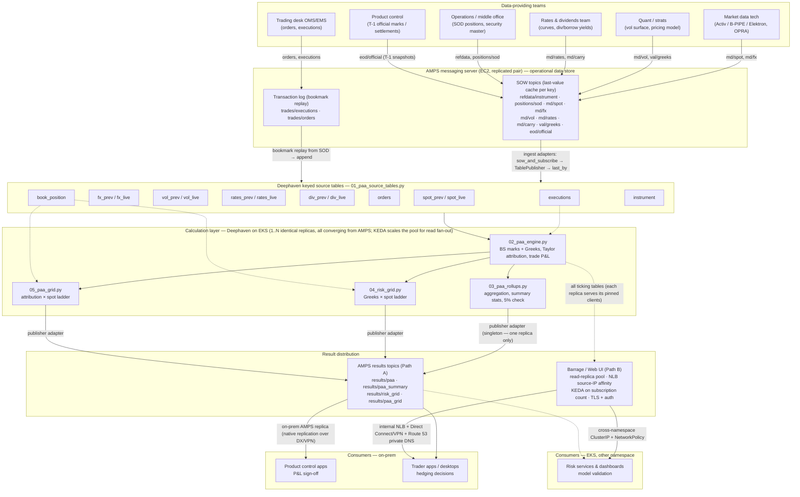

# Architecture — Teams, Data Sources, and Calculation Placement

Which teams provide which data sources, and where each calculation takes
place, to produce the PAA Grid and the Risk Grid.

## Diagram

An editable draw.io version of this diagram is in
[architecture.drawio](architecture.drawio) — open it at
[app.diagrams.net](https://app.diagrams.net) or with the draw.io desktop app
/ VS Code extension.

## Who provides which source table

| Team | Owns | Feeds tables |
|---|---|---|
| Market data technology | Vendor connectivity (Activ / Bloomberg B-PIPE / Refinitiv Elektron over OPRA) | `spot_live`, `fx_live` |
| Quant / strats | Fitted vol surface, pricing model — and the mark-time inputs (see [SNAPSHOT-COHERENCE.md](SNAPSHOT-COHERENCE.md)) | `vol_live` (marked surface) |
| Rates & dividends (treasury / equity forwards) | Discount curves, dividend & borrow forecasts | `rates_live`, `div_live` |
| Trading desk (OMS/EMS) | Order and execution flow | `orders`, `executions` |
| Operations / middle office | Overnight batch, SOD reconciliation, security master | `book_position` (reconciled SOD), `instrument` |
| Product control | Official T-1 close marks / settlements | the `*_prev` snapshot side of every market table — the anchor `PrevPrice` must reprice exactly |

## Where each calculation runs

The key placement decision: in the demo scripts, Black-Scholes pricing and
Greeks run *inside* [02_paa_engine.py](deephaven-paa/02_paa_engine.py) in
Deephaven. In production at a sell-side firm, that box splits in two:

1. **Quant pricing service** — computes marks and Greeks. It owns the model,
   must produce numbers consistent with the official EOD marks, and
   publishes each mark **with its inputs as one row**:
   `(Mark, SpotUsed, VolUsed, RateUsed, DivUsed, SnapTime)`.
2. **Deephaven engine** — does what it is structurally best at: keyed joins,
   the Taylor attribution arithmetic, trade P&L from executions, the ladder
   cross-joins for both grids, and incremental roll-ups — all ticking.

Output routing (consumers live on-prem and in another EKS namespace; two
distribution paths, detailed in
[DEPLOYMENT-AMPS-EKS.md](DEPLOYMENT-AMPS-EKS.md)):

- **Roll-ups + unexplained-breach check (03)** → product control (P&L
  sign-off) — on-prem, via AMPS `results/paa` + `results/paa_summary`
  topics (Path A, on-prem AMPS replica)
- **Risk Grid (04)** → traders (hedging: "what is my delta if spot gaps
  5%") — on-prem apps via `results/risk_grid`; interactive users via
  Barrage/Web UI over the internal NLB + Direct Connect/VPN (Path B)
- **PAA Grid (05)** → risk management (model validation — it audits the
  risk grid's Greeks; see
  [RISK-GRID-VS-PAA-GRID.md](RISK-GRID-VS-PAA-GRID.md)) — services in the
  other EKS namespace via cross-namespace Barrage (ClusterIP +
  NetworkPolicy), or `results/paa_grid` where decoupling matters

Rule of thumb: **systems consume the AMPS results topics; humans exploring
consume Barrage/Web UI.**

## Transport layer: AMPS

All source teams publish to an AMPS messaging server (running on EC2, as a
replicated pair) rather than feeding Deephaven directly. SOW topics carry
keyed last-value state (reference data, market data, positions, the
marks+Greeks feed, T-1 official snapshots); the transaction log carries
event streams (orders, executions) with bookmark replay from start-of-day.
Deephaven ingest adapters (`sow_and_subscribe` → `TablePublisher` →
`last_by`) populate the same keyed source tables, so scripts 02–05 are
unchanged. Topic design, coherence rules, and the EKS/EC2 deployment shape
are in [DEPLOYMENT-AMPS-EKS.md](DEPLOYMENT-AMPS-EKS.md).

## Simplifications in the diagram

- Scripts 04 and 05 also read `book_position`, `fx_live`, and (for a
  live-position variant) `executions` directly from the source layer, not
  only through 02 — shown as dashed edges; the main flow line keeps the
  picture readable.
- The `orders` table is audit/context only — P&L consumes `executions`
  (see [TRADE-PNL-VS-COST-PNL.md](TRADE-PNL-VS-COST-PNL.md)).

## Related docs

- [PAA.md](PAA.md) — PAA methodology
- [PAA-GRID.md](PAA-GRID.md) — PAA Grid formulas and tables
- [RISK-GRID-VS-PAA-GRID.md](RISK-GRID-VS-PAA-GRID.md) — how the two grids relate
- [SOD-VS-LIVE-POSITION.md](SOD-VS-LIVE-POSITION.md) — position anchoring per calculation
- [OPTION-PRICE-SOURCES.md](OPTION-PRICE-SOURCES.md) — vendor vs internal prices
- [SNAPSHOT-COHERENCE.md](SNAPSHOT-COHERENCE.md) — matching attribution inputs to mark-time inputs
- [README.md](README.md) — project index
